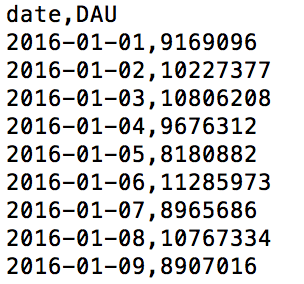
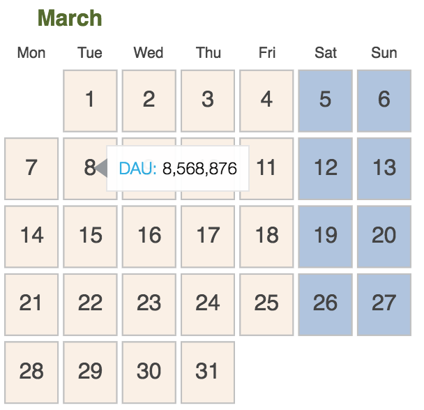
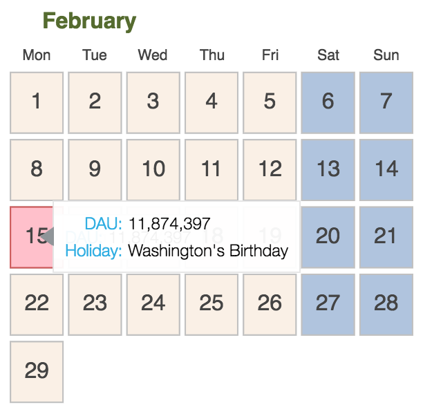

# DAU_Calendar

Interactive calendar based on [Bokeh Calendar Demo](https://github.com/bokeh/bokeh/blob/master/examples/models/calendars.py) with the purpose of including Daily Active Users (DAU) for applications that measure such a metric using python and bokeh.

In case no such information is available, I included a script that generates random uniform DAUs for the year 2016. Running this script ```$ python generate_DAU.py``` will produce the file `sample_DAU.csv` as shown in the Figure below.



Afterwards, to generate the calendar html file, simply run ```$ python calendars.py``` and open `calendars.html` in your browser.



Weekdays are colored in light beige, weekends in light blue, and US holidays in pink. By hovering over the dates, a tooltip shows the DAU for that corresponding day. In case of holidays, the tooltip also shows the name of the holiday in question.

